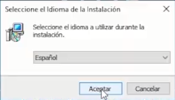
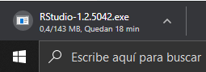

## Instalación de R

**DESCARGA: <https://www.r-project.org/>**

> NOTA: _Para el correcto funcionamiento de la aplicación RStudio siempre se debe instalar el software R._

Para instalar R descargamos el instalador desde la página oficial (arriba 1) 

Una vez en el sitio web haga clic sobre el enlace “CRAN mirror” en sección ‘Getting Started’

Al hacer clic sobre tal enlace, nos redirige automáticamente a otra página en la cual debemos escoger un servidor específico para descargar los archivos (o ‘mirror’). Como primera opción seleccionamos “0-Cloud” que automáticamente redirige a nivel mundial a los servidores pertinentes. En segundo lugar y de ser necesario puede elegir Argentina, en la práctica, puede seleccionarse cualquiera aunque idealmente debemos elegir el de nuestro país o, en su defecto, el más cercano para hacer más rápida la transferencia de información.

Se abrirá la página oficial del CRAN - The Comprehensive R Archive Network - que nos permite descargar los instaladores para distintos sistemas operativos, en este caso ubicaremos y seleccionaremos “Download R for Windows”.

Al seleccionar la opción “Download R for Windows” se accederá a la siguiente página en la cual se debe hacer clic en el enlace “install R for the first time”.

Luego debemos seleccionar la última versión disponible, en este caso es R.4.0.0

Al terminar con la descarga, buscamos el archivo ejecutable en la carpeta de descarga y hacemos doble clic sobre éste, o presionamos ‘entrar’. Lo primero que nos pedirá será el idioma que queremos instalar, que será Español, pero puede elegir el de su preferencia.

Posterior a eso, se deben seguir las instrucciones de instalación que va ofreciendo el software, hasta completar la instalación. Es decir, dejamos por defecto la ruta de la carpeta de instalación (preferiblemente), así mismo, los “componentes que nos ofrece instalar”.Respondemos “no” en “Desea utilizar las opciones de configuración?”. Dejando intacta la sección “¿Dónde deben colocarse los accesos directos del programa?” hacemos clic en siguiente. Y por último nos preguntará “¿Qué tareas adicionales deben realizarse?”, a lo cual agregaremos tildando la casilla “Crear un acceso directo en el escritorio”, y nos aseguramos que las casillas “Guarde el número de versión en el registro” y “Asociar archivos .RData con R”, luego, siguiente.

Una vez concluido el proceso, el software habrá quedado instalado en el computador.

---

## Instalación de RStudio

**DESCARGA: <https://rstudio.com/>**

> NOTA: _Para el correcto funcionamiento de la aplicación RStudio debe tener instalado el software R._

Una vez en el sitio web oficial de RStudio, accedemos por una de dos vías, directamente haciendo clic en Download.

O desplegando la pestaña Products y seleccionando la opción RStudio. 

Dentro de esa página hay que bajar para acceder al apartado de los instaladores según nuestra necesidad, en este caso seleccionamos la versión gratuita RStudio Desktop – Open sourse – Free, como se muestra a continuación:

La misma nos redirigirá a otra página en donde haremos clic en “Download RStudio for Windows” para comenzar la descarga.

Una vez culminada la descarga es preciso buscar y ejecutar el instalador para RStudio desde la carpeta donde fue descargado. Luego de seguir todas las instrucciones del proceso de instalación el programa habrá quedado instalado correctamente. Es necesario enfatizar que en lo posterior solamente se ejecutará RStudio, y nunca el software R. Este último queda instalado y RStudio se encarga de ejecutarlo. 

Siempre se usará el icono de RStudio para abrir una nueva sesión del programa.

